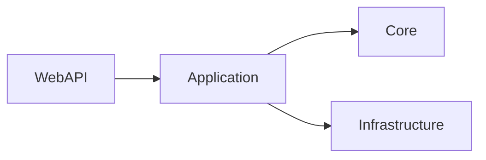

# Backend Architecture

The backend follows a layered clean architecture:

* **Core** – shared models, enums, and cross-cutting concerns
* **Application** – business services, validators, and mappings
* **Infrastructure** – database entities, repositories, caching, integrations
* **WebAPI** – controllers, filters, middleware

> Warning: Avoid placing business logic inside controllers; keep it within services.

Additional design notes can be found in [service dependencies](../../Docs/service-dependencies.md).

↩ [Back to Architecture Index](./_index.md)
