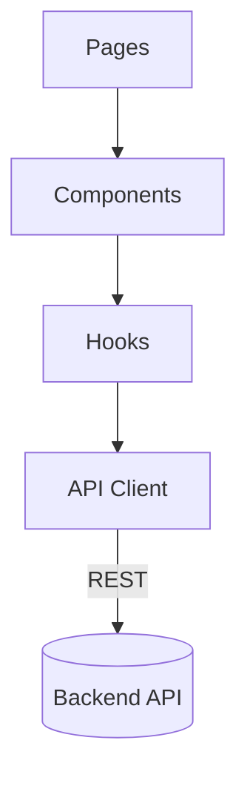

# Frontend Architecture

The frontend uses Next.js with React and TypeScript.

> Note: i18n is handled via `next-i18next` with message keys mirroring backend translations.

↩ [Back to Architecture Index](./_index.md)
