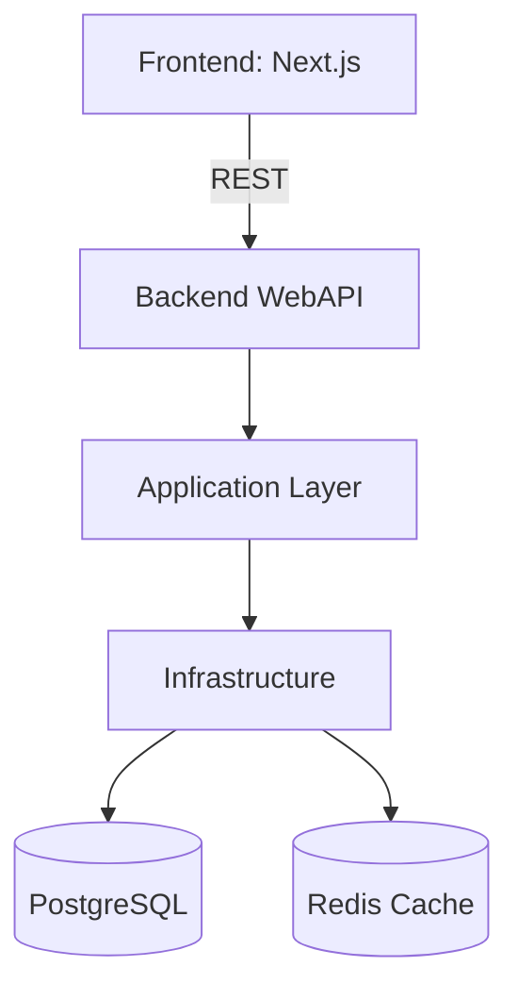

# Architecture Overview

> Note: For detailed database schema see [SYS Schema](../../Docs/bus_system_schema.md).

See also: [Backend Architecture](backend-architecture.md) and [Frontend Architecture](frontend-architecture.md).

↩ [Back to Architecture Index](./_index.md)
