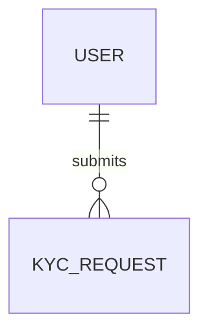

# KYC Module

## Purpose
Manages Know Your Customer verification.

## Entities & Relationships


## Permissions
| Code | Description |
|------|-------------|
| `kyc.manage` | Submit, resubmit, view or delete vendor KYC |
| `kyc.verify` | Review and approve vendor KYC |

## Validation
- Documents must be provided in PDF format

## Caching
- KYC status cached for 1h

## API
See [KYC API](../api/kyc.md)

## Vendor KYC Endpoints
| Method | Endpoint | Permission | Description |
|--------|----------|------------|-------------|
| `POST` | `/api/vendor/kyc/start/v1` | `kyc.manage` | Submit vendor KYC application |
| `GET` | `/api/vendor/kyc/status/v1` | `kyc.manage` | Get current KYC status |
| `PUT` | `/api/vendor/kyc/resubmit/v1` | `kyc.manage` | Resubmit KYC documents |
| `DELETE` | `/api/vendor/kyc/delete/v1` | `kyc.manage` | Delete pending application |
| `POST` | `/api/admin/kyc/approve/v1` | `kyc.verify` | Review and approve vendor submission |

## Sample Requests & Responses

### Submit
```bash
curl -X POST "https://api.example.com/api/vendor/kyc/start/v1" \
  -H "Authorization: Bearer <token>" \
  -H "Content-Type: application/json" \
  -d '{"legalName":"Acme Corp","taxId":"123456789","documents":["doc1.pdf"]}'
```
**Response**
```json
{
  "id": "UUID",
  "status": "pending",
  "lastUpdatedAt": "2024-03-01T12:00:00Z"
}
```

### Get Status
```bash
curl -X GET "https://api.example.com/api/vendor/kyc/status/v1" \
  -H "Authorization: Bearer <token>"
```
**Response**
```json
{
  "id": "UUID",
  "status": "pending",
  "lastUpdatedAt": "2024-03-01T12:00:00Z",
  "rejectionReason": null
}
```

### Review
```bash
curl -X POST "https://api.example.com/api/admin/kyc/approve/v1" \
  -H "Authorization: Bearer <token>" \
  -H "Content-Type: application/json" \
  -d '{"verificationId":"UUID","approve":true,"reason":"Looks good"}'
```
**Response**
```json
{
  "status": "approved"
}
```

## Testing
- Validator tests ensure required documents

## Related Frontend
[Frontend KYC Module](../../frontend/modules/kyc.md)

↩ [Back to Backend Modules](./_index.md)
