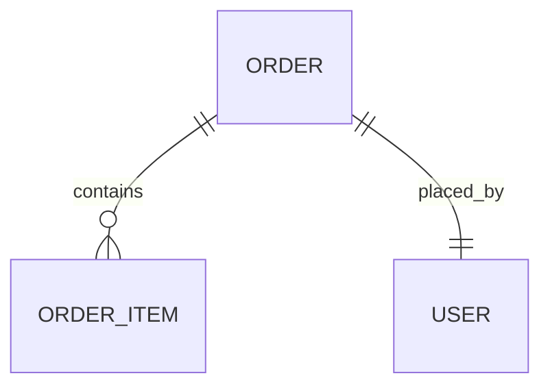

# Orders Module

## Purpose
Processes customer orders and shipment tracking.

## Entities & Relationships

## Permissions
| Code | Description |
|------|-------------|
| `orders.view` | View orders |
| `orders.manage` | Create or update orders |

## Validation
- Orders require at least one item

## Caching
- Order summaries cached for 5m

## API
See [Orders API](../api/orders.md)

## Testing
- Service tests ensure status transitions

## Related Frontend
[Frontend Orders Module](../../frontend/modules/orders.md)

↩ [Back to Backend Modules](./_index.md)
