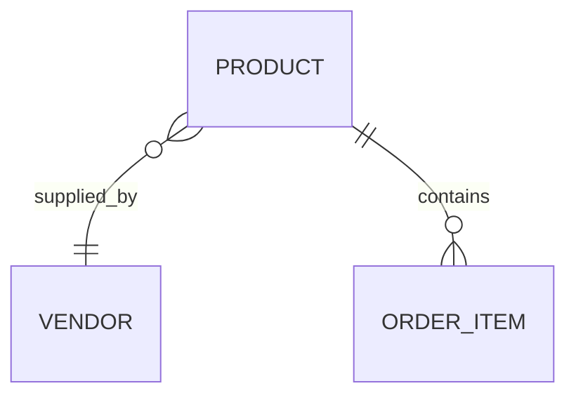

# Products Module

## Purpose
Handles product catalog and categories.

## Entities & Relationships

## Permissions
| Code | Description |
|------|-------------|
| `products.view` | View products |
| `products.manage` | Create or update products |

## Validation
- SKU must be unique

## Caching
- Product details cached for 30m

## API
See [Products API](../api/products.md)

## Testing
- Integration tests cover product listing

## Related Frontend
[Frontend Products Module](../../frontend/modules/products.md)

↩ [Back to Backend Modules](./_index.md)
