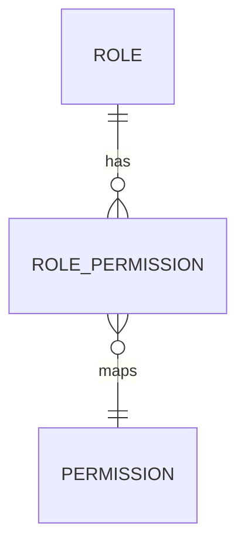

# Roles Module

## Purpose
Manages roles and their permissions.

## Entities & Relationships

## Permissions
| Code | Description |
|------|-------------|
| `roles.view` | View roles |
| `roles.manage` | Create or update roles |

## Validation
- Role names must be unique

## Caching
- Permission map cached under `permissions:map`

## API
See [Roles API](../api/roles.md)

## Testing
- Ensure role-permission mappings retrieved correctly

## Related Frontend
[Frontend Roles Module](../../frontend/modules/roles.md)

↩ [Back to Backend Modules](./_index.md)
