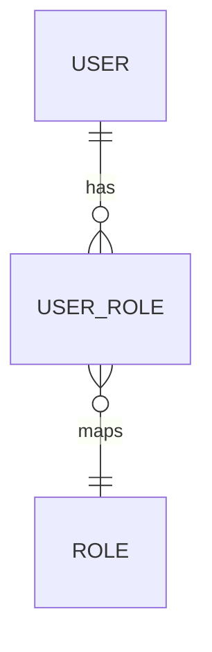

# Users Module

## Purpose
Handles user accounts and authentication.

## Entities & Relationships

## Permissions
| Code | Description |
|------|-------------|
| `users.view` | View users |
| `users.manage` | Create or update users |

## Validation
- Emails must be unique
- Passwords require at least 8 characters

## Caching
- User profiles cached under `user:{id}`

## API
See [Users API](../api/users.md)

## Testing
- Unit tests cover `UserService` scenarios

## Related Frontend
[Frontend Users Module](../../frontend/modules/users.md)

↩ [Back to Backend Modules](./_index.md)
