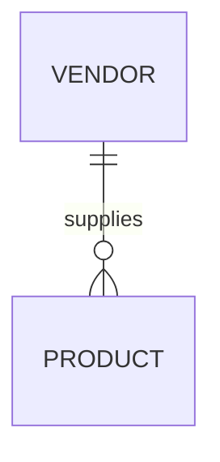

# Vendor Module

## Purpose
Handles vendor profiles and onboarding.

## Entities & Relationships

## Permissions
| Code | Description |
|------|-------------|
| `vendor.view` | View vendors |
| `vendor.manage` | Create or update vendors |

## Validation
- Tax number is required

## Caching
- Vendor list cached for 10m

## API
See [Vendor API](../api/vendor.md)

## Testing
- Service tests ensure onboarding workflow

## Related Frontend
[Frontend Vendor Module](../../frontend/modules/vendor.md)

↩ [Back to Backend Modules](./_index.md)
