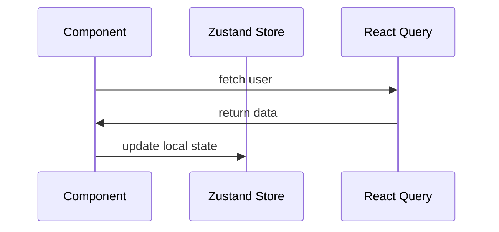

# State Management

React Query handles remote data, while Zustand stores client state.

```mermaid
sequenceDiagram
  participant C as Component
  participant Z as Zustand Store
  participant Q as React Query
  C->>Q: fetch user
  Q->>C: return data
  C->>Z: update local state
```

↩ [Back to Frontend Documentation](./_index.md)
