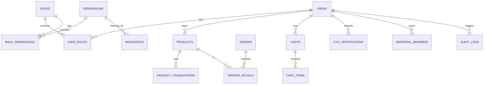

# 📦 Sky.Template Backend – Module & Database Overview

## 1️⃣ Module Overview

| Module                     | Responsibilities                                                      | Key Services                                                   | Permissions                                                                                     | Caching                                             | Validation                           |
| -------------------------- | --------------------------------------------------------------------- | -------------------------------------------------------------- | ----------------------------------------------------------------------------------------------- | --------------------------------------------------- | ------------------------------------ |
| **Product Management**     | CRUD for products, admin & vendor flows, stock tracking, localization | `AdminProductService`, `VendorProductService`                  | `Products.Read`, `Products.Create`, `Products.Update`, `Products.Delete`, `Products.HardDelete` | `[Cacheable]` on read, `[InvalidateCache]` on write | `CreateProductRequestValidator`      |
| **Global Settings**        | Platform-wide settings                                                | `SettingsService`                                              | `Settings.Manage`                                                                               | `[Cacheable]` + `[InvalidateCache]`                 | Service logic                        |
| **Vendor Settings**        | Per-vendor overrides, product-specific rules                          | `SettingsService` (vendor overrides), `ProductSettingsService` | `Settings.Override`, `Settings.Manage`                                                          | `[Cacheable]` + `[InvalidateCache]`                 | Service logic                        |
| **Caching Infrastructure** | Declarative cache control via attributes                              | `CacheableAttribute`, `InvalidateCacheAttribute`               | —                                                                                               | Redis-based key/pattern cache                       | Prevents caching for dynamic filters |
| **Permissions Framework**  | Centralized access control                                            | `HasPermissionAttribute`                                       | All permission constants                                                                        | Optional caching of permission data                 | —                                    |

---

## 2️⃣ Database Schema Overview

### Enums

**Status & Workflow**

* `status_enum`: ACTIVE, INACTIVE, SUSPENDED, DELETED
* `kyc_status_enum`: UNVERIFIED, PENDING, VERIFIED, REJECTED, EXPIRED
* `order_status_enum`: PENDING, PAID, SHIPPED, DELIVERED, CANCELLED, FAILED
* `payment_status_enum`: AWAITING, PAID, CONFIRMED, FAILED, REFUNDED
* `shipment_status_enum`: PREPARING, SHIPPED, DELIVERED, CANCELLED, RETURNED
* `return_status_enum`: PENDING, APPROVED, REJECTED
* `referral_reward_status_enum`: PENDING, GRANTED, EXPIRED, REJECTED

**Domain Types**

* `document_type_enum`: ID, PASSPORT, DRIVER\_LICENSE
* `buyer_type_enum`: INDIVIDUAL, CORPORATE
* `product_type_enum`: PHYSICAL, DIGITAL, SERVICE
* `supplier_type_enum`: REGULAR, PREMIUM, EXCLUSIVE
* `discount_type_enum`: PERCENTAGE, FIXED, SHIPPING
* `discount_target_enum`: CART, PRODUCT, CATEGORY, ALL\_PRODUCTS
* `cart_status_enum`: ACTIVE, ABANDONED, CONVERTED

**System**

* `permission_action_enum`: VIEW, CREATE, EDIT, DELETE, EXPORT, REPORT, SOFT\_DELETE, ROLE\_ASSIGN
* `movement_type_enum`: IN, OUT, RETURN, CORRECTION

---

### Core Tables (Schema: `sys`)

* **users** – System users, linked to vendors, creator/updater, referral chain.
* **roles** – Role definitions, mapped via `user_roles`.
* **resources** – Permission grouping.
* **permissions** – Action-level permissions linked via `role_permissions`.
* **user\_roles** – User-role mapping (composite PK).
* **role\_permissions** – Role-permission mapping (composite PK).
* **system\_settings** – Global configuration (unique `key`).
* **vendor\_settings** – Vendor-specific configuration (unique `(vendor_id, key)`).
* **audit\_logs** – Change tracking with JSONB diffs.
* **error\_logs** – Error and stack trace logging.
* **refresh\_tokens** – JWT refresh token store.
* **file\_uploads** – File metadata & storage context.
* **kyc\_verifications** – KYC submissions & status.
* **vendors** – Vendor companies, linked from products/users.
* **product\_categories** – Category hierarchy (recursive).
* **products** – Product records linked to vendors/categories.
* **product\_translations** – Localized product names/descriptions.
* **discounts** – Discount rules, usage limits.
* **discount\_usages** – Tracking of discount application.
* **buyers** – Buyer entities with optional linked user.
* **buyer\_addresses** – Shipping/billing addresses.
* **orders** – Orders linked to vendor/buyer.
* **orders\_details** – Order line items (unique per order).
* **returns** – Return requests.
* **shipments** – Shipping tracking info.
* **payment\_methods** – Supported payment methods.
* **payments** – Payment transactions.
* **suppliers** – Supplier records & payment terms.
* **stock\_movements** – Inventory updates.
* **invoices** – Invoice records.
* **order\_status\_log** – Order status change history.
* **carts** – Shopping cart (unique active per user).
* **cart\_items** – Items in cart (unique per cart).
* **referral\_rewards** – Referral program tracking.

---

### Views

* **vw\_product\_category\_paths** – Recursive category breadcrumb.
* **vw\_vendor\_orders\_summary** – Vendor sales/revenue aggregation.
* **vw\_user\_referral\_chain** – Recursive referral chain mapping.

---

## 3️⃣ Visual Relationships Summary

This document unifies **business modules** with the **physical database schema**, showing service responsibilities, permissions, and storage model in one place.
